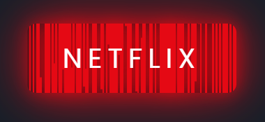

# 🎬 Netflix Style Button Effect

## 📌 Project Overview
This project features a **Netflix-inspired hover button effect** using **HTML, CSS, and JavaScript**. The effect creates a smooth **animated glow and transition**, enhancing the visual appeal of buttons.

## 🌟 Features
- **Dynamic hover animation** similar to Netflix.
- **Randomized transition delays** for a unique effect.
- **Fully responsive** and lightweight.

## 🛠️ Technologies Used
- **HTML5** – Structure of the button.
- **CSS3** – Styling and animation effects.
- **JavaScript** – Dynamically generates animated spans.

## 📂 Project Structure
```
📦 Netflix-Button-Effect
 ┣ 📜 index.html        # Main HTML file
 ┣ 📜 style.css         # Styling and animation effects
 ┗ 📜 script.js         # JavaScript logic for dynamic spans
```

## ▶️ How to Run
1. **Clone the repository:**
   ```bash
   git clone https://github.com/yashpatil-1/button-hover-netflix.git
   cd Netflix-Button-Effect
   ```
2. **Open `index.html`** in your browser.
3. **Hover over the button** to see the Netflix-style animation!

## 📸 Screenshot

## 🎯 Future Enhancements
- Allow customization of **button text and colors**.
- Implement more **hover effects** for different themes.
- Convert to a **CSS-only animation** for optimization.

## 🤝 Contributing
Feel free to fork this repository, enhance features, and submit a pull request.


## 📞 Contact
For any inquiries, reach out via **[workwithme.3215@gmail.com](mailto:workwithme.3215@gmail.com)** or visit my **[GitHub Profile](https://github.com/yashpatil-1)**.

---
🎬 **Enjoy this Netflix-style button effect!** 🚀

